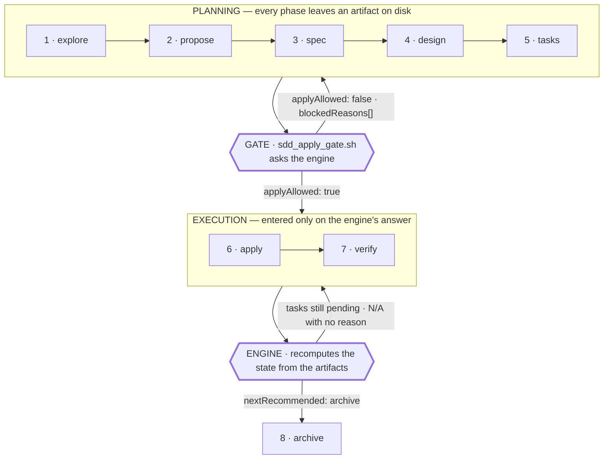

# agent-engineering

**The spec-driven cycle we put coding agents through — and the engine that decides when a phase is actually finished.**

[](https://github.com/adrian-ruda/agent-engineering/actions/workflows/ci.yml)


<sub>The first badge is the workflow's own status — it goes red when the suite
breaks. There is deliberately no hand-written <code>tests passing</code> badge
beside it: a number typed into a URL stays green forever, and a repository about
systems that misreport their own state has no business shipping one. The count
is one command away in <a href="#tests">Tests</a>.</sub>

---

## The cycle

Eight phases. Every one of them leaves an artifact on disk. Nothing moves forward
because an agent said it was done — it moves forward because a program read the
artifacts and said so.



The two hexagons are the whole point. Everything else is process discipline that
any team can adopt on a whiteboard; those two are the part that has to be code,
because they are the part a tired human or an eager agent will skip.

---

## The problem

An agent finishes a long run and reports:

> Implementation complete. All tasks done. Ready to archive.

The task file, in the same repository, at the same moment, has 57 of 88 items
still unchecked.

Both statements came out of the same run. One of them is a summary the model
wrote about itself; the other is the work. Route on the summary and the whole
method becomes theater — plausible prose, produced under exactly the pressure
that makes shortcuts attractive, consumed by an orchestrator with no way to tell
a real "done" from a confident one.

The fix is not a better prompt. It is refusing to ask.

**A phase's status is computed from the artifacts on disk, emitted as a
structured token, and consumed by a gate that can say no.** Prose has no vote.

```json
{
  "nextRecommended": "apply",
  "applyAllowed": true,
  "blockedReasons": ["1 task still pending in tasks.md — complete it before archiving"]
}
```

`nextRecommended` is a routing token with a closed vocabulary, not a sentence.
The prose lives in `blockedReasons[]`, where it is for humans to read and for
nothing to parse.

---

## How work moves

Each phase produces one artifact and is closed by one rule. The engine reads the
tree and reports where the change actually stands.

| # | Phase | Produces | What closes it |
|---|-------|----------|----------------|
| 1 | explore | understanding, notes | nothing on disk — the one phase the engine does not score |
| 2 | propose | `proposal.md` | the file exists |
| 3 | spec | `specs/{capability}/spec.md` | a recursive walk finds a non-empty `spec.md`; a flat one at the change root does **not** count |
| 4 | design | `design.md` | the file exists |
| 5 | tasks | `tasks.md` | the file exists **and** its guard lines are resolved |
| 6 | apply | `apply-report.md` | the report exists **and** zero tasks are still pending |
| 7 | verify | `verify-report.md` | the report exists, zero tasks pending, and no failing verdict inside it |
| 8 | archive | `archive-report.md` | every build phase closed **and** `blockedReasons` is empty |

Rows 6 and 7 are where the method earns its keep. "The report exists" is the
cheap check that every naive implementation does — including ours, for a while.
It is also the check an agent satisfies by writing a report.

### Every phase reports one of four states

`blocked` · `ready` · `in_progress` · `all_done`

`in_progress` is the state that matters. Without it, a phase whose artifact
exists but whose work is unfinished has to round to one of the other three, and
every available rounding is a lie: `all_done` invents a finish, `ready` invents a
fresh start, `blocked` invents an obstacle. A fourth state is not a nicety —
it is the difference between a status engine and a wish.

### Receipts, not assurances

Every handoff carries an auditable receipt: the JSON above, recomputed from disk
at the moment it is asked, by a program that did not do the work and has no
stake in the answer. We do not trust the agent's claim that the change is
sound — we recompute it, and the recomputation is what the next actor is allowed
to act on.

Two consequences we had to learn the hard way, both now enforced in code:

- **A verifier that cannot run is not a yes.** If the engine crashes, returns
  nothing, or returns something that is not the expected schema, the gate
  blocks and prints the real error. "I don't know" does not authorize touching
  code.
- **A gate must never block its own repair.** The anti-shortcut rule below
  blocks *archiving*, not *applying* — because the actor who has to write the
  missing justification is the one doing the apply. A gate that locks out its
  own fix has to be bypassed to be satisfied, and a gate everyone bypasses is
  decoration.

---

## What's in this repo

| Path | Lines | What it does |
|------|-------|--------------|
| `engine/sdd_status.py` | 1,011 | The oracle. Walks a change directory, classifies every phase, counts task progress, and emits the JSON receipt. Standard library only. |
| `engine/sdd_apply_gate.sh` | 213 | The blocking hook. Called before any agent is allowed to write code. Checks the artifacts, asks the engine, and refuses on anything short of a clean answer. Exit `0` approved · `1` blocked · `2` bypassed with a logged reason. |
| `engine/tests/` | 2,888 | 152 tests across 8 files. |
| `tools/skill_registry.py` | 553 | Grades the roster of capabilities an orchestrator can reach for, and regenerates the index from what the files actually declare. |
| `tools/tests/` | 978 | 114 tests across 4 files. |
| `.github/workflows/ci.yml` | 46 | Matrix on Python 3.10 and 3.13. |

The engine has exactly one coupling point to whatever repository hosts it: the
changes root, resolved `--base` → `$SDD_STATUS_BASE` → `./sdd/changes`. The gate
reads the same variable on purpose — if each resolved its own, the gate could
approve one tree while the engine judged another.

### The two chapters

The cycle above answers *what has to be true before this step runs*. Two
questions sit on either side of it, and each has its own document.

| | Question | Document |
|---|---|---|
| **Before** | Does this work belong in the cycle at all — and when do I stop? | [Routing and stop policy](docs/routing.md) |
| **Around** | The orchestrator reaches for a capability. Is that capability any good? | [Capability lifecycle](docs/capability-lifecycle.md) |

Routing is the arithmetic: thresholds for delegating, a context budget, and the
rule that a gate cannot block its own repair. The lifecycle chapter is about
grading the instructions themselves — where the score comes from, and the
retirement rule we refused to write.

---

## Quickstart

No dependencies beyond Python 3.10+ and `pytest`.

```bash
git clone <this-repo> agent-engineering
cd agent-engineering
python3 -m pytest engine/tests -q
```

### See it block something

Build a change that looks finished and is not:

```bash
mkdir -p sdd/changes/example-change/specs/checkout

echo '# Proposal — add checkout retries'  > sdd/changes/example-change/proposal.md
echo '# Spec: checkout retries'           > sdd/changes/example-change/specs/checkout/spec.md
echo '# Design — exponential backoff'     > sdd/changes/example-change/design.md
echo 'Status: success'                    > sdd/changes/example-change/apply-report.md

cat > sdd/changes/example-change/tasks.md <<'EOF'
# Tasks

Decision needed before apply: No
400-line budget risk: Low

- [x] T-1 Wire the retry helper
- [ ] T-2 Add the integration test
- [-] T-3 Backfill old orders
EOF

python3 engine/sdd_status.py example-change
```

The apply report says `Status: success`. The engine disagrees:

```json
{
  "schemaName": "agent-engineering.sdd-status",
  "schemaVersion": 1,
  "change": "example-change",
  "dependencies": {
    "proposal": "all_done",
    "spec": "all_done",
    "design": "all_done",
    "tasks": "all_done",
    "apply": "in_progress",
    "verify": "blocked",
    "archive": "blocked"
  },
  "taskProgress": {
    "total": 3,
    "completed": 1,
    "pending": 1,
    "notApplicable": 1,
    "notApplicableUnjustified": 1,
    "allComplete": false,
    "readError": null
  },
  "blockedReasons": [ "…1 task still pending…", "…1 N/A task with no stated reason…" ],
  "nextRecommended": "apply",
  "applyAllowed": true
}
```

Three things happened there.

`apply` is `in_progress`, not `all_done` — the report exists, the work does not.
`nextRecommended` still routes back to `apply` and `applyAllowed` is still
`true`, because the fix for both blockers is written *during* apply. And
`notApplicableUnjustified: 1` caught the cheapest possible shortcut: task T-3 was
struck out with `[-]` and no explanation.

Now close the real task and give the discarded one a reason:

```bash
cat > sdd/changes/example-change/tasks.md <<'EOF'
# Tasks

Decision needed before apply: No
400-line budget risk: Low

- [x] T-1 Wire the retry helper
- [x] T-2 Add the integration test
- [-] T-3 Backfill old orders — N/A: no historical orders predate the retry helper
EOF

echo 'Status: success' > sdd/changes/example-change/verify-report.md
python3 engine/sdd_status.py example-change --field nextRecommended   # archive
python3 engine/sdd_status.py example-change --field blockedReasons    # []
python3 engine/sdd_status.py example-change --field taskProgress
```

```json
{"total": 3, "completed": 2, "pending": 0, "notApplicable": 1,
 "notApplicableUnjustified": 0, "allComplete": true, "readError": null}
```

Note the denominator: `total` is still 3. Discarding work stays legitimate, and
stays visible. If N/A tasks were dropped from the total, striking out three of
six items would move the number from 3/6 to 3/3 without anyone doing anything.

### Ask the gate

```bash
bash engine/sdd_apply_gate.sh example-change     # ✅ approved, exit 0
```

And what happens when the oracle itself is broken:

```bash
printf 'this is not valid python(\n' > /tmp/broken.py
SDD_STATUS_ENGINE=/tmp/broken.py bash engine/sdd_apply_gate.sh example-change
# ❌ BLOCKED — prints the real traceback, exit 1
```

Other entry points:

```bash
python3 engine/sdd_status.py --list                                # changes in flight
python3 engine/sdd_status.py <change> --field applyAllowed         # one field, for hooks
python3 engine/sdd_status.py --base other/tree <change>            # another root
```

Clean up when you're done: `rm -rf sdd .sdd-apply-gate.log`

---

## Tests

```bash
python3 -m pytest engine/tests -q
# 152 passed
```

The file names are the history. Most of this suite was not written from a
specification — it was written from findings, each file named after the review
round that produced it.

| File | Tests | Covers |
|------|-------|--------|
| `test_sdd_status_phase_resolution.py` | 36 | Phase classification, suffixed reports, the recursive spec walk |
| `test_sdd_status_verify_parsing.py` | 35 | Structured parsing of verify reports — never a global keyword scan |
| `test_sdd_status_failclosed_audit.py` | 23 | Every path where a broken oracle must block instead of approve |
| `test_sdd_status_task_gate_deadlock.py` | 17 | Task gating that cannot lock out its own repair |
| `test_sdd_status_review2_findings.py` | 12 | Second adversarial round |
| `test_sdd_status_reviewer_findings.py` | 10 | First adversarial round |
| `test_sdd_status_round3_redesign.py` | 10 | Third round, which became a redesign |
| `test_sdd_status_boundary_stem_leak.py` | 9 | Filename-boundary collisions between artifacts |

CI runs the suite on Python 3.10 and 3.13. The workflow contains one step that
looks paranoid and is not: it asserts that `python3` resolves to the matrix
interpreter. Eight of the tests shell out to the gate, which calls `python3`
itself; without that assertion those eight would have quietly validated the same
interpreter twice and the matrix would have been decoration.

---

## What we learned running it

This engine exists because we kept catching ourselves. Four generations of the
same class of defect — a status that reported green over unfinished work — each
one found by a fresh adversarial reviewer reading the code cold, and **not one
of them found by whoever had just written it.**

That is the finding worth reporting. Self-review does not catch this class of
bug, because the author already believes the thing the bug depends on.

<details>
<summary><b>Generation 0 — the report existed, so the phase was done</b></summary>

The first version decided each phase by asking whether its artifact was on disk.
`apply-report.md` present meant `apply: all_done`. It reported a change as fully
applied while its own task file showed 57 of 88 items open — and it did so while
already computing the task progress that contradicted it, in the same run,
one field away in the same JSON object.

The interesting part is what happened next. The review that found it also found
that the fix touched twelve open changes at once, so it was **written down as a
deferred follow-up and shipped as-is.** The false green sat in the repository,
known and documented, for another commit cycle before a second pass gated
`apply` and `verify` on pending tasks and introduced the `in_progress` state.

We keep that sequence in the record deliberately. A finding is not fixed because
it is filed, and a defect the team has agreed to tolerate is still shipping.

</details>

<details>
<summary><b>Generation 1 — the fix made both phases fail together</b></summary>

Gating `apply` and `verify` on the same pending-task condition meant they
degraded in lockstep: whenever tasks were open, both phases dropped out of
`all_done` simultaneously and routing collapsed to `apply` forever. The change
could never reach verification, because reaching verification required finishing
tasks, and finishing tasks was reported by the phase that never closed.

The repair separated "is this phase complete" from "what should happen next" and
made routing responsible for never skipping a phase the dependency map calls
`in_progress`. Otherwise the false green does not disappear — it just relocates
into the routing token.

</details>

<details>
<summary><b>Generation 2 — a report with no predecessor routed forever</b></summary>

A change carrying a `verify-report.md` but no `apply-report.md` routed to
`verify` on every single call, permanently. The routing logic asked "is verify
done?" and, finding the artifact, never asked whether the phase before it had
ever happened.

It was live in two of twelve open changes when it was found. Not a hypothetical
edge case — a state the repository was already in, that nobody had noticed,
because the engine's answer was confident and wrong in a direction nobody
audits.

</details>

<details>
<summary><b>Generation 3 — the engine advertised its own shortcut</b></summary>

The strongest one, and the least comfortable.

Task lines could be marked `[-]` for not-applicable. Not-applicable tasks were
excluded from the total. So striking out three of six items moved progress from
3/6 to 3/3 — a clean green bought with one character per task, no work, no
explanation, no trace.

Then the part that still sits badly. The blocking message the engine printed
when tasks were pending **named the shortcut in its own text**: it told the
reader that unfinished items could be marked not-applicable. The one actor
capable of taking that shortcut was the one actor guaranteed to read that
message, at the exact moment of maximum pressure to be finished.

Your error messages are attack surface. They are read under pressure by the
party with the most to gain from misreading them, and anything they mention as
available will get used.

The redesign kept `[-]` legitimate and made it cost something honest:

- Not-applicable tasks **stay in the denominator**, so discarding work is
  visible in the number everyone looks at.
- Each one must carry its reason **on the same line**, where it travels in the
  diff and in `git blame` forever, and where a reviewer sees what was dropped
  and why without leaving the file.
- Unjustified ones block **archive**, never **apply** — the actor who writes the
  justification is the one doing the apply.

</details>

<details>
<summary><b>The gate that approved on crash</b></summary>

Not a status bug — a gate bug, and the worst one here.

The hook read the engine's fields one at a time, each in its own invocation,
each ending in `2>/dev/null || echo "true"`. The intent was tolerance of a
missing engine. The effect was that any crash — a syntax error, a missing
interpreter, malformed JSON — sent the traceback to `/dev/null` and defaulted
`applyAllowed` to `true`.

Reproduced exactly: same change, healthy engine → **blocked, exit 1**; same
change, one syntax error in the engine → **approved, exit 0**. A typo in the
oracle was a permission to write production code.

It now runs one invocation, captures stdout, stderr and exit code, validates the
schema, and blocks on anything unexpected while printing the real error. The
test file named `failclosed_audit` is the twenty-three tests that keep it that
way.

</details>

**Round three was not a round of fixes.** Three separate findings turned out to
be the same missing distinction, and resolving it removed more code than it
added. That is the signal we now look for: when a review round produces a
redesign rather than a patch list, the earlier rounds were treating symptoms.

---

## A note on the source

The engine's comments are in Spanish. It was written and operated by a
Spanish-speaking team, and those comments are not decoration — each rule carries
the dated defect that produced it, written next to the code that prevents it.
Rewriting a thousand lines of that prose for presentation would have risked the
most valuable thing in the file to change the language it was reasoned in.

The comments stayed as they were. Everything written for this repository — the
CI workflow, the license, this document — is in English. The JSON the engine
emits is machine-readable in any language; the `blockedReasons[]` strings, being
prose for humans, are still in Spanish.

---

## Credit

The methodology is not ours. The spec-driven cycle, the machine-token rule, the
delta-spec layout and receipt-driven delivery come from
[`gentle-ai`](https://github.com/Gentleman-Programming/gentle-ai) by Alan
Buscaglia, which we run as the base layer underneath all of this.

What is ours is the instrumentation: the Python engine, the `in_progress` state,
the task-progress fields, the anti-shortcut rule, and the fail-closed routing —
built because operating a good method at volume surfaced the places where it had
no measurement.

Full breakdown of what came from where: **[NOTICE.md](NOTICE.md)**.

---

## License

MIT — see [LICENSE](LICENSE).
