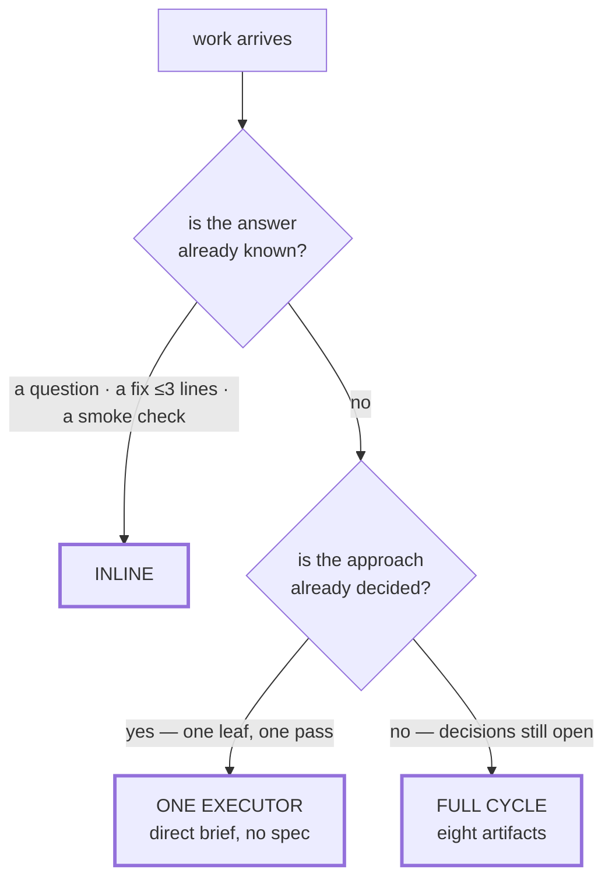
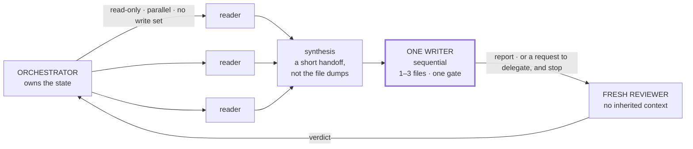

# Routing

**How the orchestrator decides what runs where, on what budget, and when to stop.**

The [README](../README.md) describes a cycle and the engine that decides when a
phase is actually finished. This is the other half of the same system: the policy
that decides whether a piece of work should enter that cycle at all, how much
context it is allowed to consume on the way, and the conditions under which a run
is abandoned instead of retried.

It is an operations policy, so it has numbers in it. The numbers are not derived
from anything — they are calibration: a threshold was set, it was wrong, it
moved. That is the reason they are worth writing down. A threshold you can be
wrong about is a threshold you can correct; *"delegate when it feels like a lot"*
cannot be wrong, and therefore never improves.

Everything here assumes the split between an orchestrator that decides what
happens next and an executor that does one bounded unit of work. This page is not
that argument. It is the arithmetic layered on top of it.

---

## Route before you run

The cycle costs eight artifacts. Most work does not deserve them. An orchestrator
that runs the full cycle on a one-line fix has not been rigorous — it has spent
the budget the next change needed.

Three routes, and the whole job is picking one:

| The work | Route | Selected by |
|---|---|---|
| A question with a known answer · a fix under ~3 lines · a smoke check | **Inline** — the orchestrator answers and reports | the answer already exists |
| A single-leaf feature whose approach is already decided | **One executor**, one direct brief, no spec | nothing is ambiguous, only unwritten |
| Multi-step work with technical decisions still open | **The full cycle** — eight artifacts | the approach has not been chosen |



The selector is **unresolved ambiguity, not size**. File count, changed lines and
perceived risk never promote work into the cycle on their own. A four-hundred-line
change with one obvious implementation is a brief; a thirty-line change that
requires choosing between two storage models is a design document. Sorting by
size instead of by ambiguity produces two failures that look opposite and are the
same mistake — ceremony on work that had no questions, and improvisation on work
that had several.

One consequence worth stating plainly, because it is the rule most often
violated: **crossing a delegation threshold selects delegation, not process.**
The two are independent axes. Work can be delegated and still carry no artifacts
at all; work can be inline and still deserve a written spec. Conflating them is
how a repository ends up with a change folder for a typo.

---

## Delegation thresholds

The routing table says how much process. This table says who runs it. The
question behind every row is the same one: *does doing this here inflate the
orchestrator's context for no gain?*

| Action | Inline | Delegate |
|---|---|---|
| Read to decide or verify | 1–3 files | — |
| Read to understand an unfamiliar area | — | **4+ files** → one narrow explorer |
| Read as preparation for a write | — | always — delegate the reading *together with* the write |
| Write one mechanical, already-understood file | yes, if it needs no research | — |
| Write non-trivial files | — | **2+ files** → exactly one writer |
| Run tests, builds, installs | — | a fresh worker per action |
| Broad research | — | one worker, returning a short synthesis |

Two of those rows are less obvious than they look.

**Read-then-edit in the same thread** is the single most expensive pattern
available to an orchestrator, and it is the one that feels most natural: read
four files to understand the change, then make the edit while everything is
still in context. The reading is now permanent — it stays in the window for the
rest of the session, and every subsequent decision pays for it. Delegating the
edit to a worker that receives only what it needs costs one dispatch and returns
the window to where it was.

**A per-action worker does not change the route.** Running the test suite in a
fresh worker is not an escalation to the full cycle; it is a way of keeping a
long-running command's output out of the thread that has to keep making
decisions. Delegation is a context decision, not a ceremony decision.

There is one deliberate exception, and it is narrow: read-only diagnosis of up to
about five files may stay inline, because it is reading to *decide*, not reading
to *build*. The exception covers reading only. The moment it becomes a write, it
is a delegation.

### The context budget

| Measurement | Meaning |
|---|---|
| **≤15%** of the window consumed after a completed task | healthy |
| **~30%** consumed with no delegation | the orchestrator is executing, not directing |

The second number is not a resource limit. Nothing breaks at 30% — there is
plenty of room left. It is a **symptom reading**: an orchestrator that has
consumed a third of its window without dispatching anything has been doing the
work itself, and the cost of that shows up two hours later as a session that has
to be restarted mid-change. The threshold is set where the behaviour becomes
visible, not where the resource runs out.

The session-drift trigger works the same way. Roughly **20 tool calls, 5 file
reads, or 2 edits with no delegation** is not a failure — it is a prompt to stop
and ask what is being carried that should have been handed off.

---

## One run, one responsibility

The rules below all descend from one observation: an executor that is given more
than one job does the first one and reports on all of them.

1. **One run is one responsibility, 1–3 files, and one gate.** A brief that mixes
   implementation with tests, reports, checklist updates and bookkeeping must be
   split before it is dispatched, not after it comes back partially done.

2. **The brief fits in ~350 words.** Objective, paths, acceptance criteria,
   prohibitions — with no re-telling of the project. This is a measurement, not a
   style preference: the word count is a proxy for the number of responsibilities.
   A brief that needs a thousand words of background is a brief whose task is not
   bounded, and shortening the prose does not fix that.

3. **The orchestrator owns the state.** The executor edits; the orchestrator runs
   the checks, reconciles the checklist, and decides the next step. Handing an
   entire cycle to a single leaf recreates exactly the situation the split exists
   to prevent — one actor doing the work and grading it.

4. **The definition of done is frozen before implementation starts.** Findings
   raised afterwards go to follow-up. They do not reopen a satisfied requirement
   unless they carry evidence of real risk. Without this rule the acceptance
   criteria drift upward for as long as anyone keeps looking, and nothing ever
   ships.

5. **Two cycles, maximum:** writer → reviewer → correction → final reviewer. If it
   has not converged there, stop. Narrow the scope or escalate. A third automatic
   correction is prohibited, because by then the corrections are responding to
   each other rather than to the original problem.

6. **Circuit breaker.** One aborted run means the brief does not get resent — it
   gets split. Two aborts on the same objective means stop, with a written exit
   reason, before anything else is dispatched.

Rule 6 is the one that gets skipped, and its logic is worth spelling out. A brief
that aborted once will abort again: the defect is in the brief, not in the run.
Resending it unchanged is not a retry — it is hoping the outcome changes without
changing the input. And "stop" is not a state, it is an artifact. If stopping
does not produce a written record of what was attempted and why it failed, the
next attempt reproduces the first one from scratch.

<details>
<summary><b>What a stop has to write down</b></summary>

Stopping without a checkpoint is the same as not stopping — the next session
starts from the same position with the same information and makes the same
moves. The checkpoint is four things:

- **The diff** — what is actually modified on disk right now.
- **What was attempted**, and the failure each attempt produced.
- **The root cause, to whatever depth it is actually known** — including "not
  known", which is a legitimate and useful entry.
- **What has already been tried and did not work.** This is the one that is
  routinely omitted and the one that does all the work. A restart without it is
  a restart that will re-derive the same dead ends.

Two failure modes around this are worth naming. Writing the checkpoint "in
parallel" while continuing to work is not a checkpoint — a checkpoint requires
stopping, which is the entire point. And deleting the failed attempts to clean
up destroys the evidence; stashing preserves it at no cost.

Before an abort ever happens, five signals say the run is already in trouble:
the same error surviving more than two attempts at the same fix; a fix that has
grown to touch more than five files nobody planned for; steps that undo the
previous step; the same file or function being looked up more than three times
in one thread; and output that is identical to the last checkpoint. Any of them
is a reason to stop early, while stopping is still cheap.

</details>

---

## A gate cannot block its own repair

This is the bootstrap problem of enforcement, and anyone who has run fail-closed
gates seriously has met it: the gate blocks, and the thing that would satisfy the
gate is the thing the gate is blocking. At that point the obvious move is to turn
the gate off, which is precisely what this rule forbids — because a gate everyone
turns off is decoration, and decoration that looks like enforcement is worse than
no gate, since it also produces confidence.

The rule has two halves.

**First: place the blocking condition after the phase that writes the repair.**
This is usually possible and usually not done, because it requires thinking about
who fixes the violation rather than only about what the violation is. The
concrete case in this repository is in the
[README](../README.md#receipts-not-assurances): a task struck out with no stated
reason blocks *archive*, never *apply* — because the actor who has to write the
missing justification is the one doing the apply. Gate the apply and the only way
to satisfy the gate is to bypass it.

**Second: when the first half is impossible — when the gate itself is what is
broken — the repair runs in a bounded recovery lane.** A named bypass token, a
written reason, an audit line. Never an improvised edit to the check, never
deleting it to get past it. The distinction that matters:

> A bypass is a decision. A disabled gate is the absence of one.
> The first leaves a record you can count. The second leaves nothing at all.

Which is why bypass tokens should be a **closed vocabulary** rather than free
text. A fixed set of reasons can be counted, and counting them is the only way to
find out that one particular check is bypassed on four runs out of five — which
is not a discipline problem, it is a badly designed check reporting itself.

One more property, learned the expensive way. A gate that matches against a list
of names or patterns is exactly as good as that list, and **the list is data, not
logic.** The test suite covering the matching engine proves the engine works; it
proves nothing about whether the list is complete. A gate whose catalogue is
tested and whose roster is not will pass, confidently, on the one input it was
built to catch — and the miss is invisible, because a clean result looks the same
whether the rule fired and found nothing or never had the term to look for. Audit
the data on its own schedule, by hand, against a case you know should fail.

---

## Quality is not infinite ceremony

The counterweight, and the part that is uncomfortable to publish next to a set of
gates: **maximum quality means sufficient evidence inside the definition of done
and the stopping rules. Zero uncertainty is not a valid objective.** A process
that cannot say "enough" has not set a high bar — it has failed to set one.

The calibration is by appetite. A finding is a blocker only if it carries real,
exploitable risk *in the deployment context that actually exists*. A small pilot
is not a bank, and reviewing it as though it were is not caution — it is a
category error that costs the pilot.

Four rules that make that operational:

- **Separate "breaks the launch" from "follow-up", explicitly, in the review
  itself.** Only the first stops delivery. When it is genuinely unclear which one
  a finding is, it is a follow-up.
- **Gold-plating goes to follow-up, always.** Alerting, hash-based idempotency,
  proactive observability, runbooks — all of these are good, none of them blocks
  a pilot. They are the correct next change, not a defect in this one.
- **Verify the finding against the real artifact before raising it.** A finding
  derived from reading a description of a system rather than the system is a
  hypothesis, and hypotheses do not block.
- **"Approved with conditions" is a valid and frequent outcome.** A review whose
  only two verdicts are *pass* and *block* will produce blocks, because reviewers
  under uncertainty round toward the safe-looking answer and blocking always
  looks safe.

The number worth watching is not how many findings a review produces. It is what
fraction of them changed the delivery decision. If a review process produces a
blocker every single time, its severity scale has collapsed into one value and
stopped carrying information — at which point the finding is no longer evidence,
it is output.

---

## Many readers, one writer

Once the route is picked and the thresholds say to delegate, there is only one
shape the work is allowed to take:



Each leg of that shape earns its place for a different reason.

**Readers run in parallel because reading has no write set.** It is the one part
of the work that fans out with no possibility of conflict, and it is also the
part that would otherwise dominate the orchestrator's context. What comes back is
a synthesis short enough to act on — not the files.

**There is exactly one writer, and it is sequential.** Two writers on the same
tree produce a merge nobody designed. Isolated worktrees make concurrent writing
possible, but that is an explicit decision with its own overhead, not a default.

**The reviewer is fresh.** A reviewer that inherited the writer's context
inherited its assumptions along with them, and the entire value of a review is
the part of the context it does *not* have. This is the same lesson the engine's
own history taught: four generations of the same defect, every one found by a
reviewer reading cold, not one found by whoever had just written the code.

### Children never spawn children

This is not an aesthetic preference about hierarchy. It is a property of the
runtime, verified empirically: delegation depth is two. A subagent that attempts
to dispatch another subagent gets back a hard error stating that the delegation
tool is not available inside subagents. There is no configuration for it.

A physical constraint needs an escape valve, not a workaround. **A leaf that
discovers it needs work outside its scope says so in its report and stops.** The
parent decides whether to dispatch that work, narrow the brief, or drop it. What
the leaf must never do is quietly absorb the extra work itself — that is exactly
how a bounded run becomes an unbounded one, and it is invisible until the report
comes back describing three tasks instead of the one that was assigned.

The same constraint is why the orchestrator owns the state. If leaves could
delegate, state could live in several places at once. Since they cannot, there is
exactly one place it can live, and the topology stops being a choice.

### The report contract

The escape valve only works if reports have a shape. Every executor closes with
the same envelope, and its first field carries the same discipline the engine
applies to phases — a **closed vocabulary**, not a sentence:

```
status:    success | partial | blocked | needs_context
summary:   what was done, in a few lines
artifacts: paths actually written
risks:     what the next actor should know
next:      recommended next step — advisory, not authoritative
```

Two rules keep it honest:

- **No artifacts plus no executed verification is `partial`, never `success`.**
  A run that produced nothing on disk and checked nothing did not succeed; it
  reported. This is the same failure the status engine exists to catch, one layer
  out.
- **`next` is advice.** The executor is allowed an opinion about what should
  happen next and is not allowed to act on it. Routing stays with the actor that
  can see more than one leaf.

And for a second pass over the same work: read the prior state first — the
checklist, the previous report — and continue from it. An executor that starts
clean on a partially finished task will redo the finished part, and the second
report will describe work the first one already did.

### The variant: fan-out for a decision

The same shape solves a different problem when what is needed is a decision
rather than a change. Three to five isolated voices with deliberately different
angles, **one pass**, no cross-talk, and a synthesis that marks convergence *and*
disagreement rather than averaging them into a recommendation nobody made. The
hard limits are what make it useful: multiple rounds converge artificially toward
whatever the initial majority was, homogeneous roles collapse into a single
opinion wearing three hats, and fewer than three voices is not a panel. It
decides between options that already exist — it does not generate them, and it
does not write anything. It only chooses what the single writer will write.

---

## The numbers, in one place

| Threshold | Value | What it selects |
|---|---|---|
| Inline fix | ≤ 3 lines | route: inline |
| Read to decide | 1–3 files | inline |
| Read to understand | 4+ files | delegate exploration |
| Read-only diagnosis | ≤ 5 files | inline, never a write |
| Non-trivial writes | 2+ files | one writer |
| Session drift | ~20 calls · 5 reads · 2 edits with no delegation | pause and delegate |
| Context after a task | ≤ 15% | healthy |
| Context with no delegation | ~30% | the orchestrator is executing |
| Scope of one run | 1–3 files, one gate | split if larger |
| Brief length | ~350 words | split if longer |
| Review cycles | 2 maximum | stop and rescope |
| Aborts, same brief | 1 | split it, do not resend |
| Aborts, same objective | 2 | stop, with a written exit reason |
| Unplanned files pulled into a fix | > 5 | stress signal — stop early |
| Repeat lookups of one symbol in a thread | > 3 | stress signal — stop early |
| Voices in a decision fan-out | 3–5, one pass | escalate below 3, cost explodes above 5 |

---

## A note on the numbers

These are calibrated for one team's operating conditions — a particular runtime,
a particular context window, a particular tolerance for rework. Copying them
without measuring anything would be a strange thing to take from a document whose
whole argument is that thresholds are worth being wrong about in public.

What transfers is not the values. It is the practice of writing a number down at
all, so that the next time the orchestrator ends a session at 40% having
delegated nothing, there is something specific to point at — instead of a general
feeling that it could have gone better.

The cycle these rules route into, and the credit for it, are in
[NOTICE.md](../NOTICE.md). The policy on this page is what running that cycle at
volume turned out to require.
